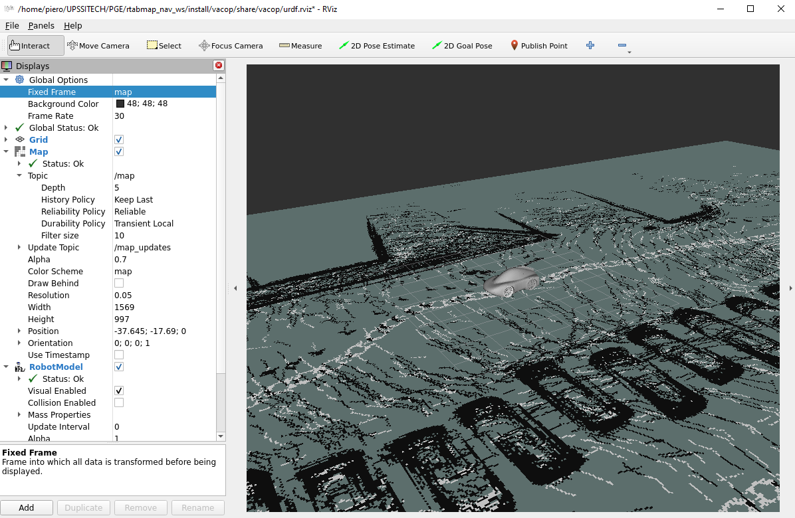

# RTAB-Map + Nav2 (localisation et navigation locale)

Ce dépôt met en place une **localisation basée sur une carte RTAB-Map existante** et une **navigation locale avec Nav2**

## 1. Prérequis

- Ubuntu 22.04  
- ROS 2 **Humble**  
- Colcon  

## 2. Installations nécessaires

```bash
sudo apt update
sudo apt-get install ros-humble-controller-manager
sudo apt-get install ros-humble-ros2-control
sudo apt-get install ros-humble-xacro

sudo apt install ros-humble-joint-state-publisher-gui
sudo apt install ros-humble-ros2-controllers
sudo apt install ros-humble-rtabmap-ros
sudo apt install ros-humble-navigation2 ros-humble-nav2-bringup
```

## 3. Compilation du workspace

Depuis la racine du workspace :

```bash
colcon build --symlink-install
source install/setup.bash
```

Source à refaire dans chaque nouveau terminal.

## 4. Lancement de l'urdf du VACOP et Rviz

```bash
ros2 launch vacop display.launch.py
```

## 5. Lancement de la localisation RTAB-Map

La localisation utilise une **base RTAB-Map existante (`.db`)**

```bash
ros2 launch rtabmap_localization map.launch.py
```

Fonctionnement :
- Recharge la carte depuis `rtabmap.db` situé dans le dossier maps de `rtabmap_localization`
- Publie la frame `base_footprint`
- Publie la carte `/map` (via `map_assembler`)
- Odométrie simulé avec `cmd_vel` pour l'instant

### Paramètres RViz (déjà configuré)

- Fixed Frame : base_footprint pour suivre le VACOP et map sinon
- Map > Topic > Durability Policy : Transient Local

Si la carte n’apparaît pas :
- relancer :
```bash
ros2 launch rtabmap_localization map.launch.py
```

RTAB-Map publie la carte à la connexion d’un abonné.



## 6. Lancement de Nav2 et MPPI

```bash
ros2 launch planif_locale nav2.launch.py
```
À utiliser avec `2D Goal Pose` de Rviz
- planification locale
- évitement d’obstacles

## 7. Odométrie (Work In Progress)

```bash
ros2 run odometry gps_odometry_node
```
Utilisation du GPS car problème avec les capteurs de vitesse des roues.

## 8. Frames TF (état actuel)

```
map → odom → base_footprint → base_link
```

- `map → odom` : RTAB-Map  
- `odom → base_footprint` 

